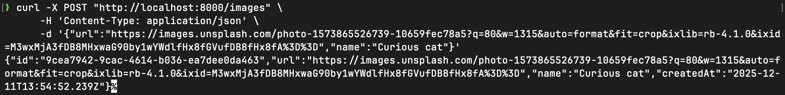
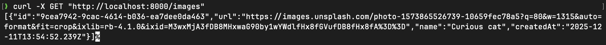
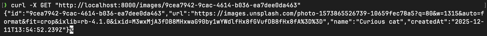
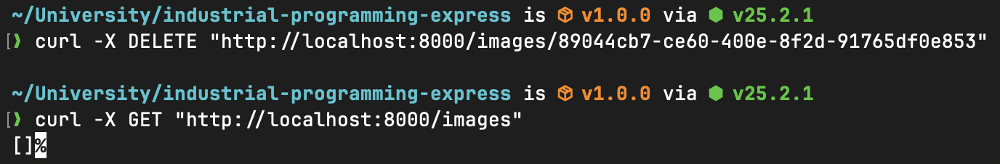

# Галерея изображений

Реализация API для галереи изображений с хранением ссылок на изображения, дополнительным именем и временем создания.
Было реализовано ООП-решение с возможностью создания иных способов хранения данных (сейчас поддерживается только in-memory).
Для входящих данных и ответов используется JSON с строгим форматом. Использована архитектура MVC.

## Стек

- Node.js + Express.js
- TypeScript
- ESLint (конфиг на базе [`@antfu/eslint-config`](https://github.com/antfu/eslint-config))
- Prettier

## Маршруты

- `POST /images` - создать запись. Тело: `{ "url": "<строка>", "name": "<опционально>" }`. Возвращает запись с `id`, `url`, `name` (или null) и `createdAt`.
- `GET /images` - получить все записи.
- `GET /images/:id` - получить запись по UUID. 404, если не найдена.
- `DELETE /images/:id` - удалить запись по UUID. 204, если удалено; 404, если не найдено.

## Примеры работы

